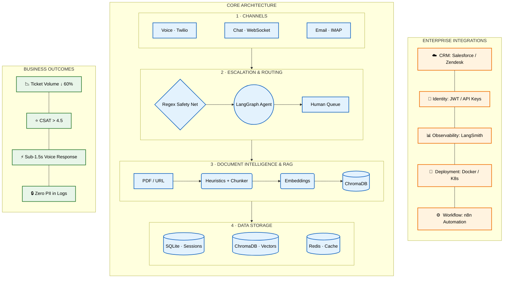
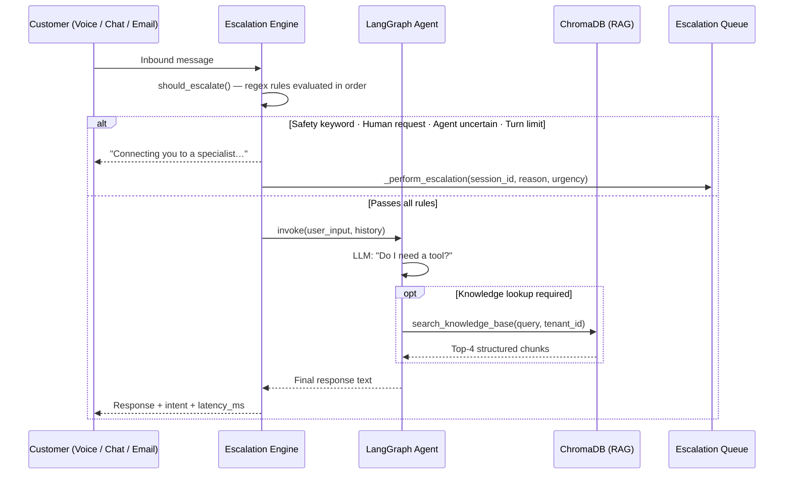
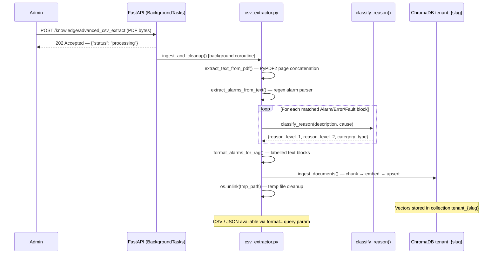

# Agentic Customer Support Platform

> A production-ready, multi-tenant AI support backend. Autonomous agents handle Voice, Chat, and Email using RAG-grounded responses, deterministic safety escalation, and a Document Intelligence pipeline that transforms unstructured technical manuals into queryable knowledge — with a clear upgrade path to Fortune 500 infrastructure.

---

## Overview

Enterprise support desks are overwhelmed by repetitive, answerable queries — fault code lookups, policy questions, troubleshooting steps. Resolving each ticket manually costs 10–15 minutes of a specialist's time. The answer is always somewhere in a manual or knowledge base that no one has time to search.

This platform solves that problem end-to-end. An admin uploads the documentation once. The **Document Intelligence pipeline** extracts, classifies, and embeds every alarm code, parameter, and procedure into an isolated tenant knowledge base. From that point, incoming messages across Voice, Chat, and Email are processed by an autonomous LangGraph agent that retrieves the right answer from ChromaDB — without hallucinating, without guessing, and without ever letting a safety-critical message touch the LLM.

The architecture is designed for production from day one: every LLM call is traced in LangSmith, every WebSocket requires JWT authentication, large PDF ingestion runs in `BackgroundTasks` so the API never blocks, and a `Recall@K` benchmarking script provides a measurable SLA on retrieval quality. The component surface maps directly onto a managed cloud stack — swap one environment variable, not one line of business logic.

---

## System Architecture

The following diagram maps every technical layer to concrete business outcomes and the enterprise integration surface a deployment team would connect to.



---

## Core Enterprise Features

### 1 · Deterministic Escalation Engine — Rules Before the LLM

Every inbound message passes through `EscalationEngine.should_escalate()` **before** the LangGraph agent is invoked. The engine enforces four ordered rules using compiled regex patterns:

| Priority | Rule | Pattern | Urgency |
|----------|------|---------|---------|
| 1 | Safety keyword in user message | `fire\|smoke\|injury\|emergency\|explosion\|accident` | `high` |
| 2 | User explicitly requests a human | `human\|engineer\|speak to\|transfer\|escalate` | `normal` |
| 3 | Agent admitted knowledge gap | `don't know\|cannot find\|not in my knowledge` | `normal` |
| 4 | Turn count exceeds `MAX_TURNS_BEFORE_ESCALATE` (env-configurable) | — | `low` |

A safety match triggers immediate human handoff. The LLM is never invoked for that message. This is the correct enterprise architecture for safety-critical deployments — deterministic guarantees, not probabilistic model behaviour.

---

### 2 · Document Intelligence Pipeline — Schema-First RAG

Standard RAG pipelines chunk raw PDFs and embed the noise. This fails on technical manuals where an alarm ID and its remedy are split across a chunk boundary.

This system applies a **schema-first extraction pipeline** before any vector is written. When a PDF is uploaded, `csv_extractor.py` applies a structured extraction sequence:

1. **Text extraction** — `PyPDF2` reads every page into a continuous string
2. **Regex alarm parser** — detects every `Alarm|Error|Fault [ID]` block and captures `alarm_id`, `description`, `cause`, `remedy`
3. **Heuristics Engine** (`classify_reason`) — keyword classifier maps each alarm to the O3Sigma Downtime Configuration schema:
   - `voltage / inverter / relay` → `Electrical`
   - `sensor / encoder / photocell` → `Sensor/Instrumentation`
   - `program / PLC / HMI / timeout` → `Software/Control`
   - default → `Mechanical`
4. **RAG formatter** (`format_alarms_for_rag`) — each alarm becomes a labelled text block with explicit field names (`ALARM CODE:`, `DESCRIPTION:`, `CAUSE:`, `ACTION:`)
5. **ChromaDB ingestion** — structured blocks are chunked, embedded with `all-MiniLM-L6-v2`, and stored in the tenant-isolated collection
6. **Dual output** — returns a CSV aligned to the O3Sigma Downtime Configuration template OR structured JSON with PDF metadata

The LLM retrieves structured, labelled records at query time — not raw page fragments.

---

### 3 · Multi-Tenant Knowledge Isolation

Every enterprise customer (tenant) has a dedicated ChromaDB collection: `tenant_{slug}`. Collection-scoped queries make cross-tenant data leakage structurally impossible — there is no query path that crosses collection boundaries. Tenant configuration (persona, escalation keywords, channel list) is stored per-tenant in SQLite and loaded on every request.

---

### 4 · LangSmith Full-Stack Observability

`LangChainTracer` is injected into every `create_react_agent` invocation when `LANGCHAIN_API_KEY` is present. Every reasoning step, tool call, retrieved chunk, and final message is captured in the LangSmith trace dashboard. This is the primary debugging surface for production deployments — when a customer reports a bad response, the trace shows exactly which chunk was retrieved, what the model decided, and where it went wrong.

---

### 5 · LangGraph State Machine — Not AgentExecutor

The agent is built on `langgraph.prebuilt.create_react_agent` with `recursion_limit: 4`. This replaces the removed `AgentExecutor` from LangChain < 1.x and adds hard loop termination. The graph is inspectable, forkable, and compatible with LangSmith tracing natively. A new processing step (e.g., a content moderation node) is additive — a new node and edge in the graph, not a rewrite.

---

### 6 · Asynchronous PDF Ingestion — BackgroundTasks

Large knowledge base uploads (400+ page manuals) are processed via `FastAPI.BackgroundTasks`. The API returns `202 Accepted` with `{"status": "processing"}` in under 100ms. The extraction, chunking, embedding, and ChromaDB write complete in the background. Temporary files are cleaned up inside the background coroutine. The event loop is never blocked.

---

### 7 · Tool-Call Error Recovery

Small open-weight models (Llama 3.3 on Groq) occasionally produce malformed tool-call JSON that bleeds into the response text. The `BaseAgent.invoke()` method applies a layered cleanup sequence — stripping `<function=...>` artifacts, skipping messages that are pure JSON tool-call objects, and returning a degraded-but-valid response rather than a `500` error. The `chat.py` error handler also intercepts `tool_use_failed` (HTTP 400) events from the Groq API, extracts any valid pre-crash text from `failed_generation`, and completes the response without surfacing the failure to the end user.

---

### 8 · n8n Automation & Webhook Callbacks

The platform features two-way integration with **n8n** for advanced workflow automation:
- **Outbound Webhooks**: Every time an escalation occurs, the agent POSTs a webhook to n8n (`/webhook/ai-agent-escalation`). This enables downstream n8n workflows to route high-urgency issues to Slack, send emails to support teams, or create CRM tickets automatically.
- **Inbound Endpoints**: n8n can call back into the agent via dedicated REST endpoints (e.g., `/n8n/ticket-resolved`, `/n8n/ingest-trigger`) to mark tickets as resolved or trigger autonomous knowledge base ingestion from external sources like Google Drive.

Pre-configured workflows are included in the `n8n_workflows/` directory.

---

## Runtime Message Flow



---

## Document Intelligence Ingestion Flow



---

## RAG Quality Benchmarking

A retrieval evaluation script is included at `scripts/evaluate_rag.py`. It runs a **Recall@K** benchmark against a configurable golden Q&A dataset and reports the percentage of queries where the correct chunk appeared in the top-K retrieved results.

```bash
# Run against a tenant's live ChromaDB collection
python scripts/evaluate_rag.py --tenant your-tenant-slug --k 3
```

**Sample output:**
```
🚀 Running RAG Retrieval Evaluation (k=3) for tenant 'obeikan'...

Query: 'What does alarm code 2008 mean?'
✅ PASS: Relevant context retrieved.

Query: 'How do I fix a mechanical jam?'
✅ PASS: Relevant context retrieved.

========================================
📊 EVALUATION RESULTS
========================================
Total Queries Tested : 3
Successful Retrievals: 3
Recall@3             : 100.00%
========================================
```

**Interpretation:** If `Recall@K` drops below 85%, tune `chunk_size`, switch to a domain-specific embedding model, or add hybrid BM25 + dense search. This benchmark is the measurable SLA on knowledge base quality — not a vibe.

---

## Local → Production Evolution

Every component in this stack has a direct managed-cloud equivalent. The LangChain and SQLAlchemy abstraction layers make each swap a configuration change, not a rewrite.

| Layer | Local / Demo | Production Enterprise |
|---|---|---|
| **LLM** | Groq `llama-3.3-70b` (free tier) | OpenAI `gpt-4o` or Anthropic `claude-sonnet-4-6` — provisioned throughput, DPA, SOC 2 |
| **PDF Parsing** | PyPDF2 (digital PDFs only) | [Docling](https://github.com/DS4SD/docling) or [Unstructured.io](https://unstructured.io) — OCR, table extraction, scanned docs |
| **Alarm Extraction** | Regex heuristics (`csv_extractor.py`) | LangGraph structured-output agent — handles irregular manual formats |
| **Vector Store** | ChromaDB local (single-node) | Pinecone, Qdrant, or Weaviate — HA, multi-region, ANN index, metadata filtering |
| **Embeddings** | `all-MiniLM-L6-v2` · 384 dims · CPU | `text-embedding-3-large` · 3072 dims · OpenAI, or Snowflake Cortex Embed |
| **Database** | SQLite (`aiosqlite`) | PostgreSQL 15 (RDS Aurora) — connection pooling, read replicas, PITR backups |
| **Session Cache** | In-memory Python dict | Redis Cluster (ElastiCache) — survives restart, shared across workers, 24h TTL |
| **Ingestion Queue** | `FastAPI.BackgroundTasks` | Celery + Redis broker — retries, dead-letter queue, distributed workers, Flower UI |
| **Voice STT** | Twilio `<Gather input="speech">` · ~3–6s | Twilio `<Stream>` → [Deepgram Nova-2](https://deepgram.com) WebSocket · < 300ms TTFT |
| **Voice TTS** | Amazon Polly Neural (via Twilio `<Say>`) | [ElevenLabs Turbo v2](https://elevenlabs.io) streaming — barge-in support · < 1.5s E2E |
| **Observability** | LangSmith (free tier) + structlog | LangSmith + Prometheus + Grafana — latency histograms, token cost, containment rate |
| **Auth** | JWT HS256 + SHA-256 API key hashing | OAuth 2.0 / SAML SSO — integrate with customer IdP (Okta, Azure AD, Google Workspace) |
| **Deployment** | Single `uvicorn` process · port 8001 | Kubernetes (EKS/GKE) — HPA on CPU/RPS, separate pods per channel, ingress rate limiting |

---

## Quick Start

### Prerequisites

- Python 3.11+
- A free LLM API key from [Groq](https://console.groq.com/) (recommended) or [Google AI Studio](https://aistudio.google.com/app/apikey)
- *(Optional)* A [LangSmith](https://smith.langchain.com) account for observability traces

### 1. Install Dependencies

```bash
git clone <repo-url>
cd ai-support-agent

python -m venv venv

# Windows
venv\Scripts\activate
# macOS / Linux
source venv/bin/activate

pip install -r requirements.txt
```

### 2. Configure Environment

```bash
cp .env.example .env
```

Minimum required variables:

```env
# LLM Provider (choose one)
LLM_PROVIDER=groq
GROQ_API_KEY=gsk_your_key_here

# OR
# LLM_PROVIDER=google
# GOOGLE_API_KEY=your_key_here

# Optional: LangSmith observability
LANGCHAIN_TRACING_V2=true
LANGCHAIN_API_KEY=ls_your_key_here
LANGCHAIN_PROJECT=ai-support-agent

# Optional: Twilio voice channel
TWILIO_ACCOUNT_SID=AC...
TWILIO_AUTH_TOKEN=...
TWILIO_PHONE_NUMBER=+1...

# Optional: Email channel
ENABLE_EMAIL_POLLER=false
```

### 3. Start the Server

```bash
# Note: port 8001 — port 8000 is reserved
uvicorn app.main:app --host 0.0.0.0 --port 8001 --reload
```

Verify startup:

```bash
curl http://localhost:8001/health
# → {"status":"healthy","version":"0.1.0","llm_provider":"groq","database":"sqlite"}
```

Interactive API docs: **http://localhost:8001/docs**

### 4. Create a Tenant

```bash
curl -s -X POST http://localhost:8001/admin/tenants \
  -H "Content-Type: application/json" \
  -d '{
    "name": "Acme Manufacturing",
    "slug": "acme",
    "config": {
      "persona_name": "Aria",
      "persona_description": "A technical support specialist for Acme factory operations, expert in machine fault codes and downtime troubleshooting.",
      "channels": ["chat", "voice", "email"]
    }
  }' | python -m json.tool
```

> **Save the returned `api_key` — it is hashed on write and cannot be retrieved again.**

### 5. Ingest a Knowledge Base

**Option A — Upload a PDF (with Document Intelligence extraction):**

```bash
# Returns structured JSON matching the O3Sigma Downtime Config schema
curl -X POST \
  "http://localhost:8001/admin/tenants/acme/knowledge/advanced_csv_extract?format=json&machine_name=KHS_Filler" \
  -F "file=@/path/to/alarm_manual.pdf" | python -m json.tool

# Returns a ready-to-import CSV
curl -X POST \
  "http://localhost:8001/admin/tenants/acme/knowledge/advanced_csv_extract?format=csv&machine_name=KHS_Filler" \
  -F "file=@/path/to/alarm_manual.pdf" \
  -o downtime_config.csv
```

**Option B — Ingest text directly (async, non-blocking):**

```bash
curl -X POST "http://localhost:8001/admin/tenants/acme/knowledge" \
  -H "Content-Type: application/json" \
  -d '{
    "sources": [
      {
        "type": "text",
        "content": "Alarm 2008: Process parameter tolerance limit undershot. Cause: Cooling system failure or temperature probe fault. Action: Check coolant flow. Reset PLC after clearing.",
        "source_name": "fault_guide_manual"
      }
    ]
  }'
# → {"status": "processing", "message": "Ingestion started in background"}
```

### 6. Chat with the Agent

**HTTP (single turn):**

```bash
curl -s -X POST http://localhost:8001/chat/message \
  -H "Content-Type: application/json" \
  -d '{
    "tenant_id": "acme",
    "customer_id": "operator-001",
    "message": "What does alarm 2008 mean on the KHS Filler?"
  }' | python -m json.tool
```

**WebSocket (real-time, JWT required):**

```javascript
const token = "your-jwt-token";
const ws = new WebSocket(
  `ws://localhost:8001/chat/ws/acme/operator-001?token=${token}`
);

ws.onmessage = (event) => {
  const data = JSON.parse(event.data);
  // {"type": "message", "content": "...", "session_id": "..."}
  // {"type": "done", "escalated": false, "intent": "fault_lookup", "latency_ms": 480}
  console.log(data);
};

ws.send(JSON.stringify({ message: "What does alarm 2008 mean?" }));
```

### 7. Benchmark Retrieval Quality

```bash
python scripts/evaluate_rag.py --tenant acme --k 3
```

### 8. Trigger Escalation Scenarios

```bash
# Safety escalation (regex intercepts before LLM — urgency: high)
curl -X POST http://localhost:8001/chat/message \
  -H "Content-Type: application/json" \
  -d '{"tenant_id":"acme","customer_id":"op-1","message":"There is smoke coming from the machine and I think there might be a fire"}'

# Human handoff request (urgency: normal)
curl -X POST http://localhost:8001/chat/message \
  -H "Content-Type: application/json" \
  -d '{"tenant_id":"acme","customer_id":"op-1","message":"I need to speak to a human engineer right now"}'
```

### 9. Voice Channel (Twilio)

Configure your Twilio phone number's **A Call Comes In** webhook to:

```
https://your-ngrok-url.ngrok.io/api/twilio/twilio/webhook/{tenant_slug}
```

The endpoint returns TwiML that greets the caller, collects speech via `<Gather input="speech">`, routes through the same LangGraph agent as chat, and speaks the response via Amazon Polly Neural TTS.

---

## API Reference

| Method | Endpoint | Auth | Description |
|--------|----------|------|-------------|
| `GET`  | `/health` | — | Health check + stack version |
| `GET`  | `/docs` | — | Swagger UI |
| `POST` | `/admin/tenants` | — | Create tenant, returns one-time API key |
| `GET`  | `/admin/tenants` | — | List all tenants |
| `GET`  | `/admin/tenants/{id}` | — | Get tenant details |
| `PUT`  | `/admin/tenants/{id}/config` | API key header | Update tenant configuration |
| `POST` | `/admin/tenants/{id}/knowledge` | — | Async ingest from JSON source list |
| `POST` | `/admin/tenants/{id}/knowledge/upload` | — | Async ingest from uploaded files |
| `POST` | `/admin/tenants/{id}/knowledge/advanced_csv_extract` | — | Document Intelligence: PDF → structured alarms → ChromaDB + CSV/JSON |
| `POST` | `/admin/tenants/{id}/knowledge/text` | — | Quick text ingestion (synchronous) |
| `POST` | `/chat/message` | — | Single-turn HTTP chat |
| `WS`   | `/chat/ws/{tenant_id}/{customer_id}?token=` | JWT | Real-time bidirectional chat |
| `POST` | `/chat/email/send` | — | Email agent endpoint |
| `POST` | `/api/twilio/twilio/webhook/{tenant_id}` | Twilio signature | Inbound voice call TwiML handler |

---

## Project Structure

```
ai-support-agent/
│
├── app/
│   ├── main.py                      # FastAPI factory, lifespan, router registration
│   ├── config.py                    # Pydantic Settings — all env vars typed
│   ├── dependencies.py              # Dependency injection (DB session, API key auth)
│   │
│   ├── api/
│   │   ├── admin.py                 # Tenant CRUD + knowledge ingestion endpoints
│   │   ├── chat.py                  # WebSocket (JWT) + HTTP chat + email endpoints
│   │   ├── voice.py                 # Twilio TwiML webhook — voice channel
│   │   └── health.py                # GET /health
│   │
│   ├── agents/
│   │   ├── base_agent.py            # LangGraph create_react_agent + LangSmith tracer
│   │   ├── support_agent.py         # SupportAgent, VoiceAgent, EmailAgent + factory
│   │   ├── escalation_engine.py     # Deterministic escalation — 4 ordered regex rules
│   │   ├── llm.py                   # get_llm() — routes Groq / Google / OpenAI
│   │   └── prompts/                 # System prompts per channel
│   │
│   ├── tools/
│   │   ├── knowledge_base.py        # @tool: search_knowledge_base(query, tenant_id)
│   │   └── escalation_tools.py      # @tool + _perform_escalation() bare coroutine
│   │
│   ├── rag/
│   │   ├── csv_extractor.py         # Document Intelligence: PyPDF2 → regex → heuristics → RAG format
│   │   ├── ingestion.py             # ingest_documents() + delete_tenant_documents()
│   │   ├── retriever.py             # retrieve() — ChromaDB similarity search
│   │   ├── vectorstore.py           # get_vectorstore(tenant_id) + get_chroma_client()
│   │   ├── embeddings.py            # get_embedding_model() — HuggingFace local
│   │   └── loaders.py               # PDF / URL / text document loaders
│   │
│   ├── models/
│   │   ├── base.py                  # SQLAlchemy async engine + init_db()
│   │   ├── tenant.py                # Tenant ORM model
│   │   ├── session.py               # ConversationSession ORM model
│   │   ├── message.py               # Message ORM model
│   │   └── schemas.py               # Pydantic request/response schemas
│   │
│   ├── services/
│   │   ├── session_service.py       # Session CRUD + in-memory + SQLite history
│   │   └── tenant_service.py        # Tenant CRUD + config management
│   │
│   ├── channels/
│   │   ├── email_handler.py         # IMAP poller + SMTP reply dispatch
│   │   └── voice.py                 # Spec-aligned voice demo endpoints
│   │
│   └── core/
│       ├── logging.py               # structlog JSON logger
│       ├── security.py              # JWT verify + SHA-256 API key hashing
│       ├── guardrails.py            # PII redaction (credit card, SSN, email, phone)
│       └── exceptions.py            # Custom exception types
│
├── scripts/
│   └── evaluate_rag.py              # Recall@K benchmark against golden Q&A dataset
│
├── tests/
│   ├── unit/
│   │   ├── test_escalation.py
│   │   └── test_guardrails.py
│   └── integration/
│       └── test_api.py
│
├── demo.html                        # Chat demo UI (served at GET /)
├── system_dataflow.html             # Architecture dataflow (served at GET /dataflow)
├── docker-compose.yml
├── requirements.txt                 # All packages pinned to exact versions
├── .env.example
└── CLAUDE.md                        # Living architecture specification
```

---

## Docker Deployment

```bash
# Start all services
docker-compose up --build

# API available at http://localhost:8001
# Swagger UI at http://localhost:8001/docs
```

---

## Running Tests

```bash
# Unit tests (no external dependencies)
pytest tests/unit/ -v

# Integration tests (requires server running on port 8001)
pytest tests/integration/ -v

# RAG quality benchmark
python scripts/evaluate_rag.py --tenant your-slug --k 3
```

---

## License

MIT


