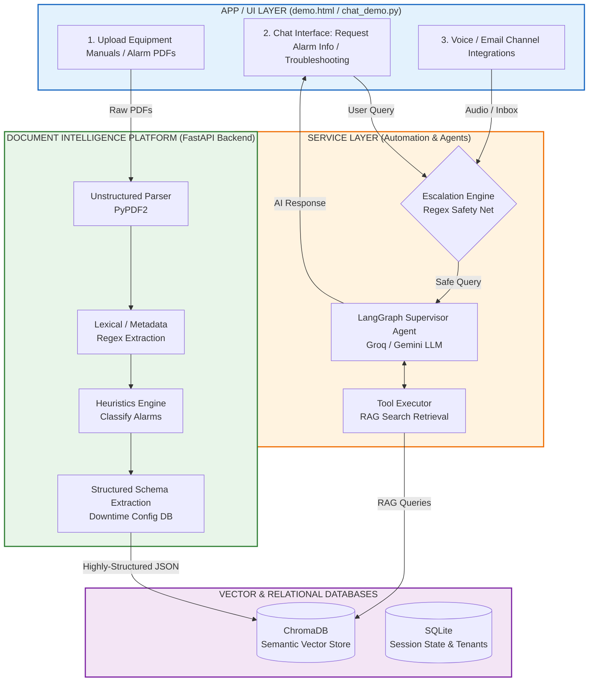
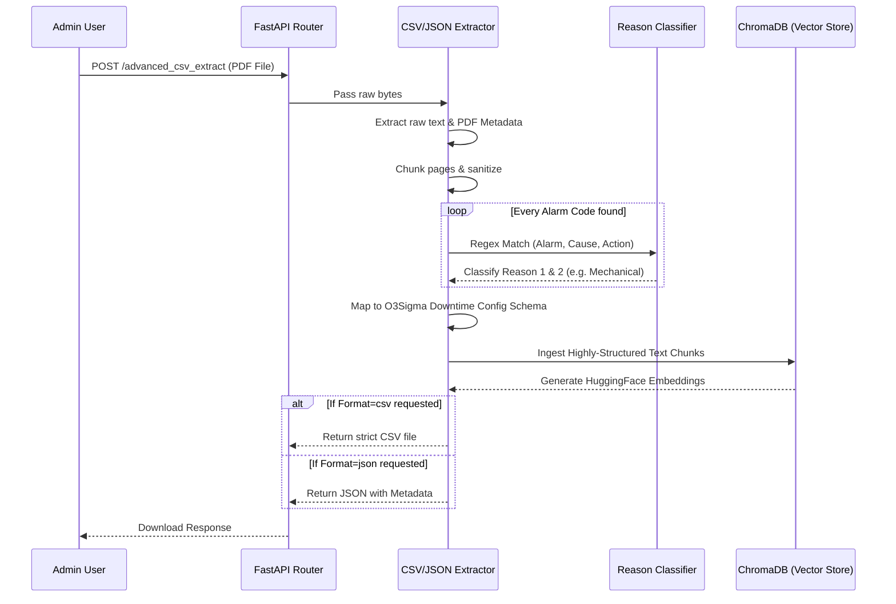
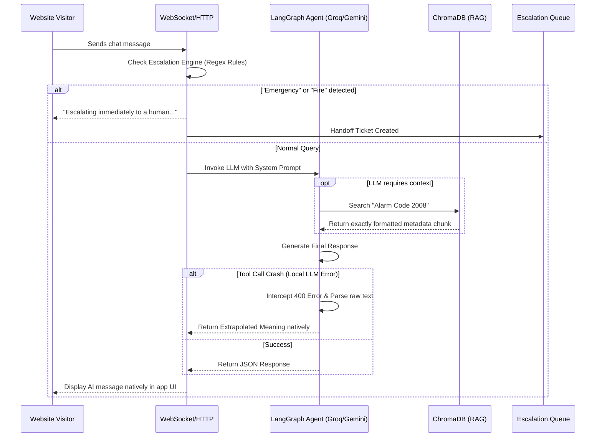

# AI Customer Support Agent - Free Tier

A production-grade, multi-channel AI customer support agent platform built entirely on **free tier** services.

## Features

- **Multi-channel support**: Chat (WebSocket), with architecture ready for voice and email
- **RAG-powered responses**: Knowledge base search using ChromaDB (local, free)
- **Smart escalation**: Automatic detection of when to hand off to humans
- **Multi-tenant**: Support multiple enterprise customers with isolated data
- **Free LLM options**: Groq (Llama 3.3) or Google Gemini free tiers

## Enterprise Safety & Reliability (New!)

To ensure production-grade reliability, this system implements features typically found in enterprise deployments:
- **Deterministic Escalation Engine**: Uses Regex patterns (`fire`, `emergency`, `speak to human`) to guarantee instant human handoff, bypassing the LLM entirely for high-risk queries.
- **LLM Timeout Protection**: Hard timeouts (e.g., 45s) on LLM reasoning loops to prevent hanging requests.
- **Tool-Call Error Recovery**: Small open-weight models (like Llama 3 on Groq) occasionally fail strict JSON tool schemas. The API intercepts these `400 tool_use_failed` errors, extracts any valid text generated by the model before the crash, infers the intent, and successfully recovers the chat response without returning a `500 Internal Server Error` to the user.
- **Rate Limit Handling**: Cleanly catches `429` errors and surfaces them as friendly notifications.

## Free Tier Stack

| Component | Technology | Notes |
|-----------|------------|-------|
| **LLM** | Groq or Google Gemini | Free API tiers |
| **Embeddings** | HuggingFace sentence-transformers | Local, free |
| **Vector Store** | ChromaDB | Local, free |
| **Database** | SQLite | Local, free |
| **Session Cache** | In-memory | Free |
| **Web Framework** | FastAPI | Free, open source |

## System Architecture Overview

The application follows a highly modular, enterprise-grade architecture split into three distinct layers. This structure guarantees that unstructured documents are cleanly converted into database records before the Artificial AI (Agent) attempts to interact with them.



### 1. Advanced Document Intelligence (RAG Ingestion)

When a complex PDF (e.g., equipment manuals or Alarm code lists) is uploaded to the system via the Advanced CSV Extractor, it goes through a multi-stage **Heuristic Pipeline**:



### 2. Chat Automation Flow & Escalation Engine

When a human user sends a message, it is processed by the **LangGraph Supervisor Agent**. The agent has autonomous tools (Knowledge Base Search via ChromaDB) and is wrapped in an **Emergency Escalation Engine** for safety.



## Quick Start

### 1. Prerequisites

- Python 3.11+
- A free API key from either:
  - [Groq](https://console.groq.com/) (recommended - fast inference)
  - [Google AI Studio](https://makersuite.google.com/app/apikey) (Gemini)

### 2. Installation

```bash
# Clone the repository
cd ai-support-agent

# Create virtual environment
python -m venv venv

# Activate virtual environment
# Windows:
venv\Scripts\activate
# macOS/Linux:
source venv/bin/activate

# Install dependencies
pip install -r requirements.txt
```

### 3. Configuration

```bash
# Copy environment template
copy .env.example .env   # Windows
# cp .env.example .env   # macOS/Linux

# Edit .env and add your API key
# For Groq:
GROQ_API_KEY=gsk_your_key_here
LLM_PROVIDER=groq

# OR for Google Gemini:
GOOGLE_API_KEY=your_key_here
LLM_PROVIDER=google
```

### 4. Run the Server

```bash
# Start the API server
uvicorn app.main:app --reload --port 8000
```

### 5. Access the API

- **API Docs**: http://localhost:8000/docs
- **Health Check**: http://localhost:8000/health

## Usage

### Create a Tenant

```bash
curl -X POST http://localhost:8000/admin/tenants \
  -H "Content-Type: application/json" \
  -d '{
    "name": "My Company",
    "slug": "my-company",
    "config": {
      "persona_name": "Aria",
      "persona_description": "A helpful customer support agent for My Company"
    }
  }'
```

**Save the API key returned - it won't be shown again!**

### Add Knowledge Base Content

```bash
# Add text content
curl -X POST "http://localhost:8000/admin/tenants/{tenant_id}/knowledge" \
  -H "Content-Type: application/json" \
  -d '{
    "sources": [
      {
        "type": "text",
        "content": "Our store hours are Monday-Friday 9am-5pm. We are closed on weekends.",
        "source_name": "store_info"
      },
      {
        "type": "text",
        "content": "Returns are accepted within 30 days with receipt. Refunds take 5-7 business days.",
        "source_name": "return_policy"
      }
    ]
  }'
### Add Knowledge Base Content (Advanced Document Intelligence)

To fix issues where the AI cannot find specific ALARM CODES because raw text chunks are too messy, you can upload manuals through the advanced extraction endpoint. This endpoint uses advanced Regex and **Heuristic Classification** to extract alarms into the structured **O3Sigma Downtime Configuration Schema**, injects them into the RAG system alongside extracted **PDF Metadata**, and returns either a CSV or structured JSON.

```bash
# Export as O3Sigma Downtime Configuration CSV
curl -X POST "http://localhost:8000/admin/tenants/{tenant_id}/knowledge/advanced_csv_extract?format=csv&machine_name=KHS_Filler" \
  -H "accept: application/json" \
  -H "Content-Type: multipart/form-data" \
  -F "file=@/path/to/your/alarm_manual.pdf" \
  -o downtime_config.csv

# Export as Structured JSON (with Document Metadata)
curl -X POST "http://localhost:8000/admin/tenants/{tenant_id}/knowledge/advanced_csv_extract?format=json" \
  -H "accept: application/json" \
  -H "Content-Type: multipart/form-data" \
  -F "file=@/path/to/your/alarm_manual.pdf"
```

### Chat with the Agent

**HTTP Endpoint:**
```bash
curl -X POST http://localhost:8000/chat/message \
  -H "Content-Type: application/json" \
  -d '{
    "tenant_id": "your-tenant-id",
    "customer_id": "customer-123",
    "message": "What are your store hours?"
  }'
```

**WebSocket (for real-time chat):**
```javascript
const ws = new WebSocket('ws://localhost:8000/chat/ws/{tenant_id}/{customer_id}');

ws.onmessage = (event) => {
  const data = JSON.parse(event.data);
  console.log(data.content);
};

ws.send(JSON.stringify({ message: "Hello!" }));
```

## Demo Runbook (Spec-Aligned)

This repo now also includes spec-aligned demo endpoints and channels:

- Chat REST: `POST /api/chat`
- Chat WebSocket: `WS /ws/chat/{session_id}`
- Voice webhooks: `POST /api/voice/incoming`, `POST /api/voice/transcribed`
- Optional email poller (disabled by default)

### 1. Configure `.env`

Set at least:

- `GROQ_API_KEY` (or keep fallback behavior if omitted)
- `LLM_PROVIDER=groq`
- `ENABLE_EMAIL_POLLER=false` (unless you configure Gmail vars)

Optional channel vars:

- Voice: `TWILIO_ACCOUNT_SID`, `TWILIO_AUTH_TOKEN`, `TWILIO_PHONE_NUMBER`
- Email: `EMAIL_ADDRESS`, `EMAIL_APP_PASSWORD`

### 2. Start backend

```bash
uvicorn app.main:app --reload --port 8000
```

### 3. Run Streamlit demo

```bash
streamlit run ui/chat_demo.py
```

### 4. Build KB from alarms (optional)

```bash
python app/knowledge_base/builder.py
```

### 5. Quick endpoint checks

```bash
curl http://localhost:8000/health
curl -X POST http://localhost:8000/api/chat -H "Content-Type: application/json" -d "{\"message\":\"Alarm 282 on KHS Filler\",\"session_id\":\"demo-1\",\"machine\":\"KHS_Filler\"}"
```

## Project Structure

```
ai-support-agent/
├── app/
│   ├── api/          # HTTP endpoints
│   ├── agents/       # LLM agent implementations
│   ├── tools/        # LangChain tools
│   ├── rag/          # Retrieval pipeline
│   ├── escalation/   # Human handoff logic
│   ├── models/       # Database models
│   ├── services/     # Business logic
│   └── core/         # Utilities
├── tests/
├── requirements.txt
└── docker-compose.yml
```

## Docker Deployment

```bash
# Build and run
docker-compose up --build

# The API will be available at http://localhost:8000
```

## API Endpoints

| Endpoint | Method | Description |
|----------|--------|-------------|
| `/health` | GET | Health check |
| `/admin/tenants` | POST | Create tenant |
| `/admin/tenants` | GET | List tenants |
| `/admin/tenants/{id}/knowledge` | POST | Add knowledge |
| `/chat/message` | POST | Send chat message |
| `/chat/ws/{tenant}/{customer}` | WS | Real-time chat |

## Upgrading to Paid Tiers

When ready to scale, you can upgrade individual components:

| Free | Paid Alternative |
|------|------------------|
| Groq/Gemini | OpenAI GPT-4o, Anthropic Claude |
| ChromaDB | Pinecone, Weaviate |
| SQLite | PostgreSQL |
| In-memory | Redis |

The architecture is designed to make these swaps straightforward.

## License

MIT License
