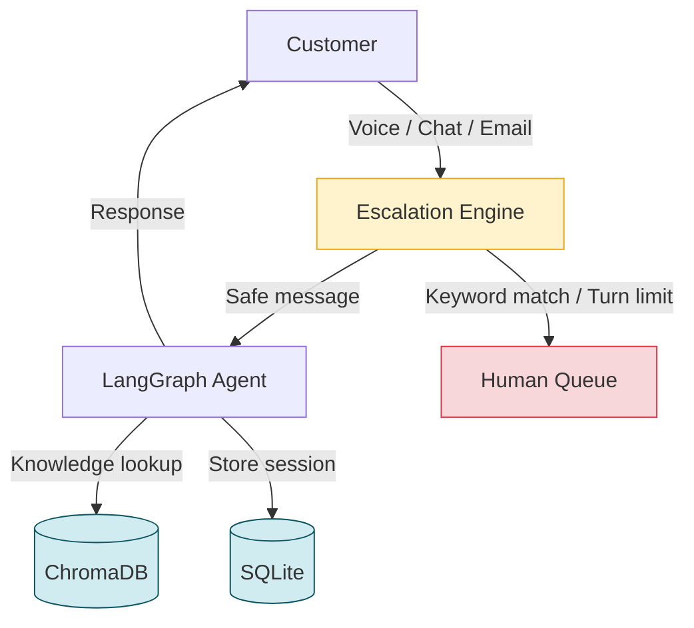
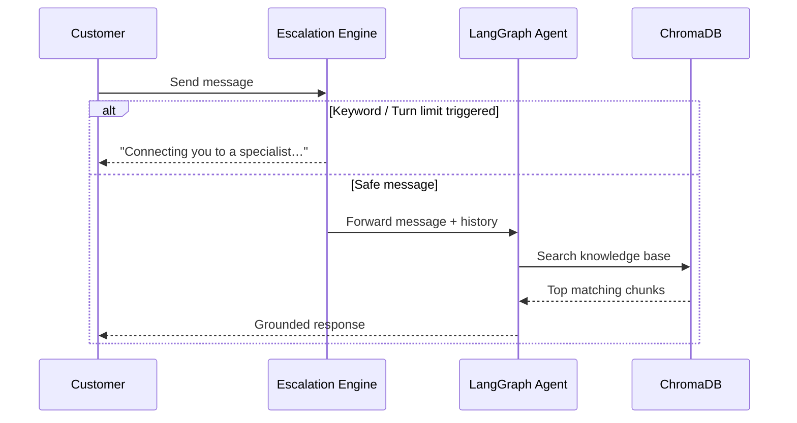
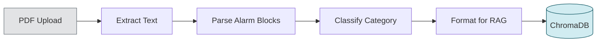

# Agentic Customer Support Platform

> A production-ready, multi-tenant AI support backend. Autonomous agents handle **Voice**, **Chat**, and **Email** using RAG-grounded responses, deterministic safety escalation, and a Document Intelligence pipeline — with a clear upgrade path to enterprise infrastructure.

---

## What It Does

Enterprise support desks are overwhelmed by repetitive, answerable queries. This platform automates them end-to-end:

1. **Admin uploads documentation once** — the pipeline extracts and indexes every alarm code, parameter, and procedure.
2. **Incoming messages** across Voice, Chat, and Email are handled by an autonomous LangGraph agent.
3. **Safety-critical messages** are intercepted by a regex engine *before* the LLM is ever called.
4. **Uncertain or high-turn conversations** are escalated to a human automatically.

---

## System Architecture



---

## Message Flow



---

## Knowledge Ingestion Flow



> **API returns 202 immediately** — all extraction and embedding happens in a non-blocking background task.

---

## Core Features

### 1 · Deterministic Escalation Engine

Every message is checked by `EscalationEngine.evaluate()` **before** the LLM is invoked. Rules fire in strict priority order:

| Priority | Trigger | Urgency |
|----------|---------|---------|
| 1 | Tenant custom keywords | `medium` |
| 2 | Legal / threat keywords (`sue`, `manager`) | `high` |
| 3 | Safety keywords (`fire`, `smoke`, `emergency`) | `medium` |
| 4 | User requests a human | `low` |
| 5 | Agent admitted uncertainty | `low` |
| 6 | Negative sentiment score | `medium` |
| 7 | Turn count exceeds `max_turns_before_escalate` | `low` |

A safety match triggers immediate human handoff — the LLM is **never invoked** for that message.

---

### 2 · Document Intelligence Pipeline

Standard RAG chunks raw text. This system applies a **schema-first extraction** before any vector is written:

1. `PyPDF2` extracts full page text
2. Regex parser captures every `Alarm / Error / Fault [ID]` block
3. Heuristic classifier maps each alarm to a category (`Electrical`, `Sensor`, `Software`, `Mechanical`)
4. Formatter creates labelled text blocks (`ALARM CODE:`, `CAUSE:`, `ACTION:`)
5. Blocks are embedded with `all-MiniLM-L6-v2` and stored in the tenant's ChromaDB collection

The LLM retrieves **structured, labelled records** — not raw page fragments.

---

### 3 · Multi-Tenant Isolation

Each tenant has a dedicated ChromaDB collection `tenant_{slug}`. Collection-scoped queries make cross-tenant data leakage structurally impossible.

---

### 4 · LangSmith Observability

`LangChainTracer` is injected into every agent call when `LANGCHAIN_API_KEY` is set. Every reasoning step, tool call, retrieved chunk, and final response is captured in the LangSmith trace dashboard.

---

### 5 · Tool-Call Error Recovery

Small open-weight models occasionally produce malformed tool-call JSON that bleeds into response text. `BaseAgent.invoke()` applies a layered cleanup — stripping `<function=...>` artifacts and returning a graceful fallback rather than a `500` error.

---

### 6 · n8n Workflow Automation

- **Outbound**: On every escalation, the agent POSTs to n8n (`/webhook/ai-agent-escalation`) — enabling Slack alerts, CRM ticket creation, or email notifications.
- **Inbound**: n8n can trigger knowledge base ingestion or mark tickets resolved via `/n8n/ingest-trigger` and `/n8n/ticket-resolved`.

Pre-configured workflows are in `n8n_workflows/`.

---

## Local → Production

| Layer | Local | Production |
|-------|-------|------------|
| **LLM** | Groq `llama-3.3-70b` (free) | OpenAI `gpt-4o` / Anthropic Claude |
| **Vector Store** | ChromaDB (local) | Pinecone / Qdrant / Weaviate |
| **Database** | SQLite | PostgreSQL (RDS Aurora) |
| **Session Cache** | In-memory dict | Redis Cluster (ElastiCache) |
| **Ingestion Queue** | `BackgroundTasks` | Celery + Redis |
| **Voice STT** | Twilio `<Gather>` (~3–6s) | Deepgram Nova-2 WebSocket (<300ms) |
| **Observability** | LangSmith free | LangSmith + Prometheus + Grafana |
| **Deployment** | `uvicorn` single process | Kubernetes (EKS/GKE) with HPA |

---

## Quick Start

### 1. Install

```bash
git clone <repo-url>
cd ai-support-agent
python -m venv venv
venv\Scripts\activate        # Windows
# source venv/bin/activate   # macOS / Linux
pip install -r requirements.txt
```

### 2. Configure

```bash
cp .env.example .env
```

Minimum required:

```env
LLM_PROVIDER=groq
GROQ_API_KEY=gsk_your_key_here

# Optional: observability
LANGCHAIN_TRACING_V2=true
LANGCHAIN_API_KEY=ls_your_key_here
LANGCHAIN_PROJECT=ai-support-agent
```

### 3. Run

```bash
uvicorn app.main:app --host 0.0.0.0 --port 8001 --reload
```

```bash
curl http://localhost:8001/health
# → {"status":"healthy","version":"0.1.0","llm_provider":"groq","database":"sqlite"}
```

Interactive docs: **http://localhost:8001/docs**

### 4. Create a Tenant

```bash
curl -X POST http://localhost:8001/admin/tenants \
  -H "Content-Type: application/json" \
  -d '{
    "name": "Acme Manufacturing",
    "slug": "acme",
    "config": {
      "persona_name": "Aria",
      "persona_description": "Technical support for Acme factory operations.",
      "channels": ["chat", "voice", "email"]
    }
  }'
```

> Save the returned `api_key` — it is hashed on write and **cannot be retrieved again**.

### 5. Ingest a Knowledge Base

```bash
# PDF → structured alarms → ChromaDB (returns JSON)
curl -X POST \
  "http://localhost:8001/admin/tenants/acme/knowledge/advanced_csv_extract?format=json&machine_name=KHS_Filler" \
  -F "file=@/path/to/alarm_manual.pdf"

# Or ingest text directly
curl -X POST http://localhost:8001/admin/tenants/acme/knowledge \
  -H "Content-Type: application/json" \
  -d '{
    "sources": [{
      "type": "text",
      "content": "Alarm 2008: Cooling system failure. Action: Check coolant flow and reset PLC.",
      "source_name": "fault_guide"
    }]
  }'
```

### 6. Chat

```bash
curl -X POST http://localhost:8001/chat/message \
  -H "Content-Type: application/json" \
  -d '{"tenant_id":"acme","customer_id":"op-001","message":"What does alarm 2008 mean?"}'
```

**WebSocket (real-time):**

```javascript
const ws = new WebSocket(`ws://localhost:8001/chat/ws/acme/op-001?token=YOUR_JWT`);
ws.onmessage = (e) => console.log(JSON.parse(e.data));
ws.send(JSON.stringify({ message: "What does alarm 2008 mean?" }));
```

### 7. Test Escalation

```bash
# High-urgency — intercepted before LLM
curl -X POST http://localhost:8001/chat/message \
  -H "Content-Type: application/json" \
  -d '{"tenant_id":"acme","customer_id":"op-1","message":"There is smoke coming from the machine!"}'
```

---

## API Reference

| Method | Endpoint | Description |
|--------|----------|-------------|
| `GET` | `/health` | Health check |
| `GET` | `/docs` | Swagger UI |
| `POST` | `/admin/tenants` | Create tenant (returns API key) |
| `GET` | `/admin/tenants` | List all tenants |
| `PUT` | `/admin/tenants/{id}/config` | Update tenant config |
| `POST` | `/admin/tenants/{id}/knowledge` | Async ingest from JSON |
| `POST` | `/admin/tenants/{id}/knowledge/upload` | Async ingest from file |
| `POST` | `/admin/tenants/{id}/knowledge/advanced_csv_extract` | PDF → alarms → ChromaDB |
| `POST` | `/chat/message` | Single-turn HTTP chat |
| `WS` | `/chat/ws/{tenant_id}/{customer_id}?token=` | Real-time WebSocket chat |
| `POST` | `/api/twilio/twilio/webhook/{tenant_id}` | Inbound voice (TwiML) |

---

## Project Structure

```
ai-support-agent/
├── app/
│   ├── main.py                  # FastAPI factory + router registration
│   ├── config.py                # Pydantic Settings (all env vars typed)
│   ├── api/                     # Route handlers (admin, chat, voice, health)
│   ├── agents/
│   │   ├── base_agent.py        # LangGraph agent + LangSmith tracer
│   │   ├── support_agent.py     # SupportAgent / VoiceAgent / EmailAgent
│   │   └── escalation_engine.py # Deterministic escalation (7 ordered rules)
│   ├── tools/                   # LangChain @tools (knowledge search, escalation)
│   ├── rag/
│   │   ├── csv_extractor.py     # PDF → regex → heuristics → RAG format
│   │   ├── ingestion.py         # ingest_documents() → ChromaDB
│   │   └── retriever.py         # Similarity search
│   ├── models/                  # SQLAlchemy ORM + Pydantic schemas
│   ├── services/                # Session + Tenant CRUD
│   └── core/                   # Logging, security, guardrails, exceptions
├── scripts/
│   └── evaluate_rag.py          # Recall@K benchmark
├── tests/
│   ├── unit/                    # test_escalation.py, test_guardrails.py
│   └── integration/             # test_api.py
├── .github/workflows/ci.yml     # GitHub Actions (pytest on every push)
├── docs/openapi_dump.json        # OpenAPI spec snapshot
├── docker-compose.yml
├── requirements.txt
└── .env.example
```

---

## Testing & Quality

```bash
# Unit tests (no external dependencies required)
pytest tests/unit/ -v

# Integration tests (requires server on port 8001)
pytest tests/integration/ -v

# RAG retrieval benchmark (Recall@K)
python scripts/evaluate_rag.py --tenant your-slug --k 3
```

CI runs automatically on every push via **GitHub Actions** (`.github/workflows/ci.yml`).

---

## Docker

```bash
docker-compose up --build
# API → http://localhost:8001
# Docs → http://localhost:8001/docs
```

---

## License

MIT
